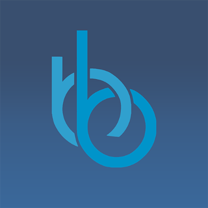

# 💫 Moses (Musa)
**Android Developer | 3D/AR Enthusiast | CS Student**

Hi, I’m **Musa**, also known as **Mufasa** online — an Android developer building apps that combine **clean UI, solid performance, and 3D/AR experiences**.  
I focus on practical projects that solve real problems.

---

## 🚀 Skills
- **Android Studio (Java/Kotlin)**
- **Jetpack Compose**
- **Unity + AR Foundation**
- **Python**
- **JavaScript**
- **3ds Max**
- **AutoCAD**
- **Photoshop**
- **Illustrator**
- **Networking (general)**
- **Basic SSH usage**

---

## 📱 Published Apps (Google Play)

  <!-- Logo -->
  

    
  

  <!-- Text -->
  

    <h3>🔹 Mental Arithmetic + Career Advisor</h3>
    Custom-speed arithmetic + job suggestion system 
    👉 https://play.google.com/store/apps/details?id=com.berk.bilim
  

  <!-- Logo -->
  

    
  

  <!-- Text -->
  

    <h3>🔹 Turkmenistanyn Dermanlyk Ösimlikleri</h3>
    Offline book, search, and favorites 
    👉 https://play.google.com/store/apps/details?id=com.medicine.kitaphana
  

---

## 🛠 Current Projects
- AR furniture placement app (Unity + Android)  
- Chemistry mini-translator (CSV-based)  
- UI/UX upgrades for offline book app  

---

## 🎯 Goals
- Build a polished AR app  
- Improve 3D asset creation workflow  
- Strengthen my portfolio for **MEXT**  
- Release more clean, useful apps

---

## 🛡️ Badges

---

## 📊 GitHub Stats

<picture>
  <source srcset="https://github-readme-stats.vercel.app/api?username=MUSA-ANN1&show_icons=true&theme=dark" media="(prefers-color-scheme: dark)" />
  <source srcset="https://github-readme-stats.vercel.app/api?username=MUSA-ANN1&show_icons=true&theme=default" media="(prefers-color-scheme: light)" />
  
</picture>

---

## 📫 Contact
**Email:** musa.annaguliev@gmail.com  
**Instagram:** https://www.instagram.com/musa.annaguliev  
**Telegram:** https://t.me/Mu4asa  
**IMO:** https://s.imoim.net/spEXKo  

---

## ⚡ Fun Info
- Naruto fan  
- Loves cameras & GoPro  
- Teamwork believer
