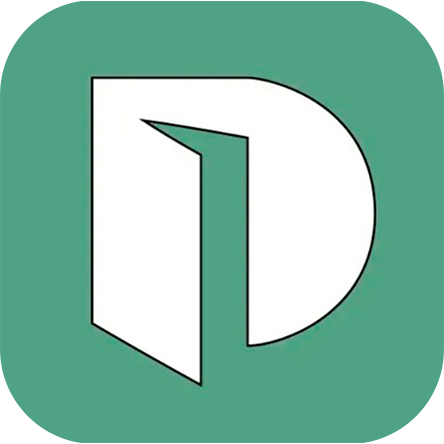
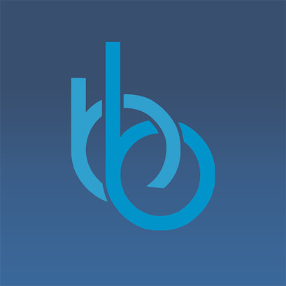

# 💫 Moses (Musa)
**Android Developer | 3D/AR Enthusiast | CS Student**

Hi, I’m **Musa**, also known as **Mufasa** online — an Android developer building apps that combine **clean UI, solid performance, and 3D/AR experiences**.  
I focus on practical projects that solve real problems.

---

## 🚀 Skills
- **Android Studio (Java/Kotlin)**
- **Jetpack Compose**
- **Unity + AR Foundation**
- **Python**
- **JavaScript**
- **3ds Max**
- **AutoCAD**
- **Photoshop**
- **Illustrator**
- **Networking (general)**
- **Basic SSH usage**

---

## 📱 Android Applications
<table>  
  <tr>  
    <td width="120" valign="top">  
        
    </td>  
    <td>  
      <h3>🔹 Türkmenistanyň Dermanlyk Ösimlikleri</h3>  
      Offline book, search, and favorites.   
      Features <b>5 languages</b>: Turkmen, English, Russian, Japanese, Spanish.   
      Includes detailed descriptions, scientific names, and herbal uses for Turkmen medicinal plants.   
      Fully offline, fast search, favorites system, clean UI optimized for reading.  

👉 <a href="https://play.google.com/store/apps/details?id=com.medicine.kitaphana">Download</a> 
👉 <a href="https://github.com/MUSA-ANN1/Turkmenistan-s-Medicinal-Plants-app">Source code</a>  
    </td>  
  </tr>  
</table>   
 

<table>
  <tr>
    <td width="120" valign="top">
      
    </td>
    <td>
<h3>🔹 Berk bilim</h3>
Mental Arithmetic + Career Advisor. 

Custom-speed arithmetic + job suggestion system. 

<b>🧠 Mental Arithmetic:</b> 
• Choose number range (1–10000) 
• Choose speed (very slow → ultra fast) 
• Numbers appear one-by-one at chosen speed 
• User calculates total mentally 
• Enter final answer at the end 
• App checks correctness & saves results 
• Great for focus, accuracy, and brain training 

<b>🎓 Career Advisor:</b> 
• 160 Yes/No questions 
• Each Yes adds points to 1 of 10 career groups 
• Example: questions 1, 11, 21… belong to group 1 
• System finds the highest score at the end 
• Suggests the most suitable job field 

👉 <a href="https://play.google.com/store/apps/details?id=com.berk.bilim">Download</a> 
👉 <a href="https://github.com/MUSA-ANN1/Berk-Bilim">Source code</a>
    </td>
  </tr>
</table>  
 

<table>  
  <tr>  
    <td width="120" valign="top">  
        
    </td>  
    <td>  
      <h3>🔹 Mini Chemistry Translator</h3>  
      Offline chemistry term translator based on CSV data.   
      Includes fast search and instant results.   
      Covers essential chemistry terminology used in school-level study.   
      Lightweight, offline, and easy to use.  

👉 <a href="https://play.google.com/store/apps/details?id=com.medicine.kitaphana">Download</a> 
👉 <a href="https://github.com/MUSA-ANN1/Turkmenistan-s-Medicinal-Plants-app">Source code</a>  
    </td>  
  </tr>  
</table>   
 

<table>  
  <tr>  
    <td width="120" valign="top">  
        
    </td>  
    <td>  
      <h3>🔹 Töleg Counter</h3>  
      Simple and offline monthly payment counter for home utilities. 
      Calculates water, gas, and electricity expenses. 
      User can change tariff values anytime. 
      Stores previous months’ data for quick comparison. 
      Fast, minimal, and easy to use.  

👉 <a href="#">Download</a> 
👉 <a href="#">Source code</a>  
    </td>  
  </tr>  
</table>
 

---

## 🛠 Current Projects
- AR furniture placement app (Unity + Android)  
- UI/UX upgrades for offline book app  

---

## 🎯 Goals
- Build a polished AR app  
- Improve 3D asset creation workflow  
- Strengthen my portfolio for **MEXT**  
- Release more clean, useful apps

---

## 🛡️ Badges

---

## 📊 GitHub Stats

<picture>
  <source 
    srcset="https://github-readme-stats-sigma-five.vercel.app/api?username=MUSA-ANN1&show_icons=true&theme=dark" 
    media="(prefers-color-scheme: dark)" 
  />
  <source 
    srcset="https://github-readme-stats-sigma-five.vercel.app/api?username=MUSA-ANN1&show_icons=true&theme=default" 
    media="(prefers-color-scheme: light)" 
  />
  
</picture>

---

## 📫 Contact
**Portifolio Web Site:** <a href="https://musa-ann1.github.io/My-portifolio-webSite">Link</a>
**Email:** musa.annaguliev@gmail.com  
**Instagram:** <a href="https://www.instagram.com/musa.annaguliev">musa.annaguliev</a>  
**Telegram:** <a href="https://t.me/Mu4asa">𝓜𝓾𝓼𝓪</a>  
**IMO:** <a href="https://s.imoim.net/spEXKo">M.</a>
